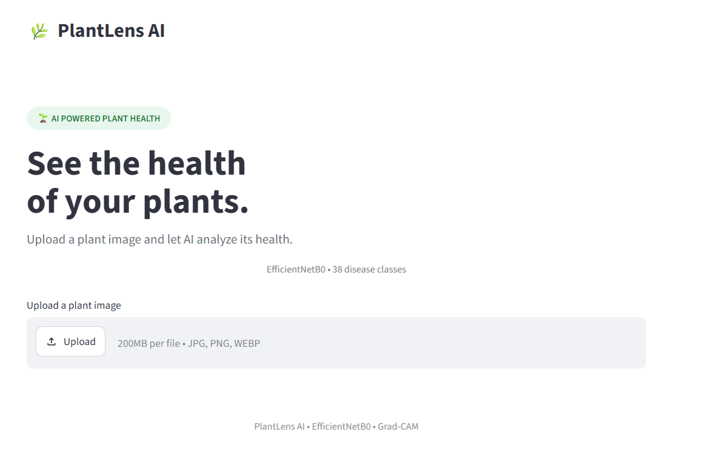
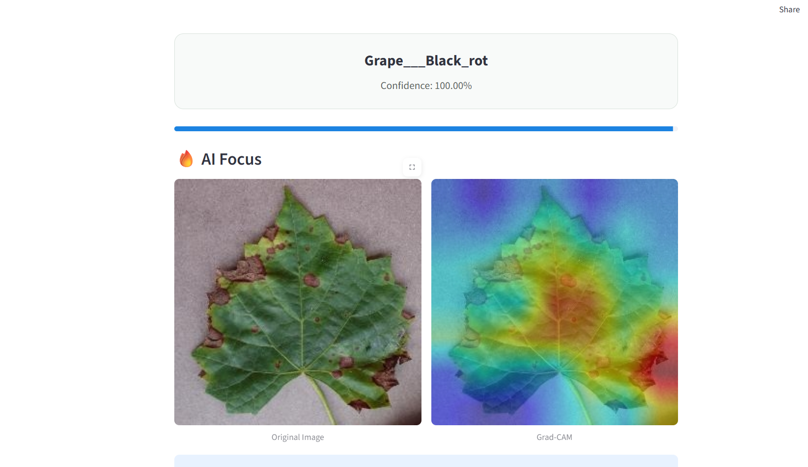

# 🌿 PlantLens AI — Plant Disease Prediction

An AI-powered plant disease detection system that classifies plant leaf images using **EfficientNetB0** and provides an interpretable **Grad-CAM** visualization of the regions influencing the prediction.

## 🚀 Features

- 🌱 Plant disease classification across **38 classes**
- 🧠 EfficientNetB0 with transfer learning
- 🔥 Grad-CAM based model explainability
- 📊 Prediction confidence score
- 🖼️ Original image vs AI Focus visualization
- ⚡ FastAPI backend
- ⚛️ React + Vite frontend
- 📤 Drag-and-drop image upload

## 🏗️ Architecture

```text
Plant Image
     ↓
React Frontend
     ↓
FastAPI REST API
     ↓
Image Preprocessing
     ↓
EfficientNetB0
     ↓
Prediction + Confidence
     ↓
Grad-CAM
     ↓
Result + Visualization
```

## 🖥️ Application Preview

### Plant Image Upload



### Disease Prediction & Grad-CAM



## 🛠️ Tech Stack

| Category | Technology |
|---|---|
| Language | Python, JavaScript |
| Deep Learning | TensorFlow / Keras |
| Model | EfficientNetB0 |
| Explainability | Grad-CAM |
| Backend | FastAPI |
| Frontend | React + Vite |
| Image Processing | Pillow, NumPy |
| Version Control | Git, GitHub |

## 📁 Project Structure

```text
plant-disease-prediction/
├── backend/
│   ├── app/
│   │   ├── gradcam.py
│   │   ├── main.py
│   │   ├── model.py
│   │   ├── preprocessing.py
│   │   └── visualization.py
│   ├── model/
│   │   ├── class_names.json
│   │   └── plant_disease_model.keras
│   └── requirements.txt
│
├── frontend/
│   └── src/
│       ├── components/
│       ├── services/
│       ├── App.jsx
│       └── index.css
│
├── notebooks/
├── Test_img/
├── README.md
└── .gitignore
```

## ⚙️ Run Locally

### Backend

```bash
cd backend
pip install -r requirements.txt
uvicorn app.main:app --reload
```

Backend:

```text
http://127.0.0.1:8000
```

### Frontend

Open another terminal:

```bash
cd frontend
npm install
npm run dev
```

Frontend:

```text
http://localhost:5173
```

## 🔥 Grad-CAM

Grad-CAM highlights the image regions that contributed most strongly to the model's prediction, making the classification more interpretable.

> Warmer regions generally indicate stronger model activation.

## 📌 Example

```text
Input → Plant Leaf Image

Output →
Disease: Grape — Black Rot
Confidence: 99%+
AI Focus: Grad-CAM visualization
```

## 🔮 Future Improvements

- Model performance optimization
- Additional plant/disease classes
- Improved explainability
- Production deployment
- Prediction history
- Mobile-friendly experience

## ⚠️ Disclaimer

This project is intended for **educational and demonstration purposes**. Predictions should not be considered a substitute for professional agricultural diagnosis.

## 👨‍💻 Author

**Ashutosh Kumar Singh**

[GitHub](https://github.com/Ashutosh-260506)
